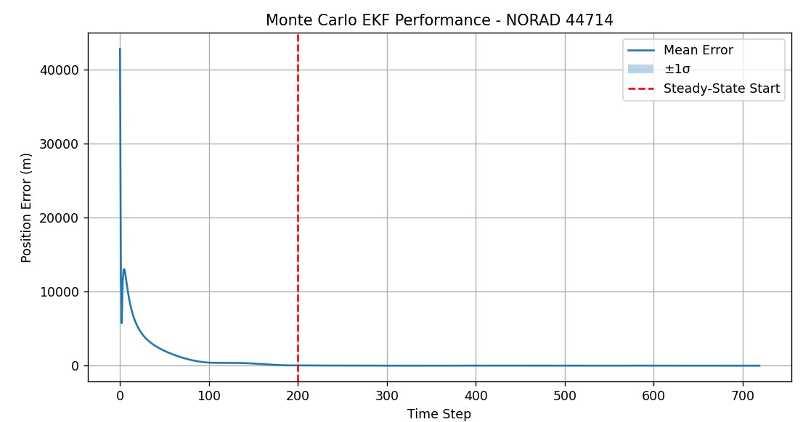

# Starlink Orbit Determination using Extended Kalman Filter

## Overview

This project implements an Extended Kalman Filter (EKF) for orbit determination of a real Starlink satellite using publicly available TLE data.

Truth model:
- SGP4 propagation (CelesTrak TLE)

Filter dynamic model:
- Two-body Keplerian motion
- J2 perturbation

Measurement model:
- Cartesian position with Gaussian noise (50 m)

Monte Carlo campaign:
- 20 independent runs
- Statistical performance evaluation

---

## Results

Monte Carlo Performance Summary:

- Global RMS: ~2.3 km (includes convergence phase)
- Steady-State RMS: ~22 m
- Convergence time: ~46 minutes

The filter converges consistently across all runs.

---

## Methodology

State vector:

x = [rx, ry, rz, vx, vy, vz]

Dynamic model:

r_dot = v  
v_dot = -μ r / |r|³ + J2 perturbation

EKF implemented with numerical Jacobian and RK4 propagation.

---

## Why This Project Matters

This demonstrates:

- Orbit determination implementation
- Extended Kalman Filter design
- Model mismatch handling (SGP4 vs Kepler+J2)
- Statistical validation via Monte Carlo

Relevant for:
- AOCS
- GNC
- Space systems engineering

---

## How to Run

Install dependencies:

pip install -r requirements.txt

Run:

python src/starlink-orbit-determination-ekf

---

## Possible Extensions

- Range/Azimuth/Elevation measurement model
- Analytical Jacobian
- NEES consistency test
- Ballistic coefficient estimation
- UKF implementation
